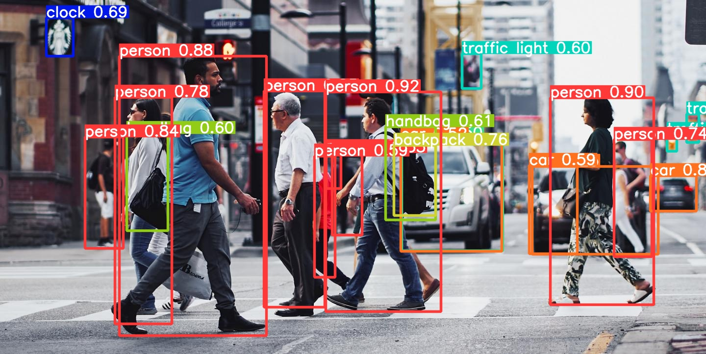

# YOLOv6 

## Introduction

YOLOv6 is a single-stage object detection framework dedicated to industrial applications, with hardware-friendly efficient design and high performance.



YOLOv6-nano achieves 35.0 mAP on COCO val2017 dataset with 1242 FPS on T4 using TensorRT FP16 for bs32 inference, and YOLOv6-s achieves 43.1 mAP on COCO val2017 dataset with 520 FPS on T4 using TensorRT FP16 for bs32 inference.

YOLOv6 is composed of the following methods:

- Hardware-friendly Design for Backbone and Neck
- Efficient Decoupled Head with SIoU Loss

## Quick Start

### environment

```shell
conda create --name yolov6 python=3.9

conda activate yolov6
```

### Install

```shell
git clone https://github.com/animeesh/yolov6_inferencing
cd yolov6_inferencing
mkdir videos
pip install -r requirements.txt
```

### Inference


```shell
python v6_video.py 
```


